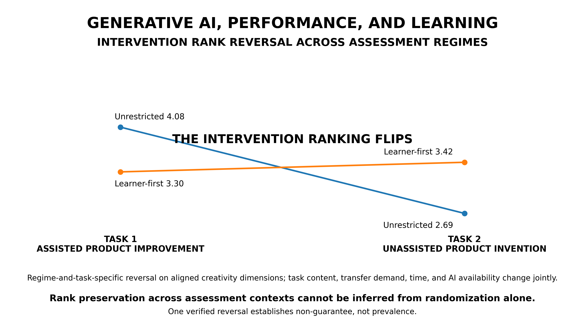

# Generative AI, Performance, and Learning: Intervention Rank Reversal Across Assessment Regimes

 

**Public code, results, and reproducibility repository for the manuscript _Generative AI, Performance, and Learning: Intervention Rank Reversal Across Assessment Regimes_.**

> **Attila Kovari (2026).** _Generative AI, Performance, and Learning: Intervention Rank Reversal Across Assessment Regimes_. Manuscript. Publication venue and DOI will be added only after a final publication record exists.

- **Repository:** https://github.com/kovariati/GenAI-Rank-Reversal
- **Release:** `v1.0.0` is planned after the article has a definitive bibliographic record; no release URL or repository DOI is claimed before it exists
- **Preferred scientific citation:** associated manuscript/article for methods and findings
- **Software reuse:** after the publication-linked release is created, cite that version-specific release as well and follow `LICENSE`
- **Machine-readable citation:** `CITATION.cff`, `CITATION.bib`, `CITATION.ris`
- **Machine-readable discovery metadata:** `codemeta.json`, `ARTICLE_METADATA.json`, `llms.txt`
- **Publication metadata:** intentionally not invented; update `PROJECT_METADATA.json` after journal/DOI/repository identifiers actually exist



## Why this project matters

Generative AI can improve performance while assistance is available without guaranteeing the same ordering of interventions when people are later assessed independently. This repository operationalizes one central methodological problem: **whether intervention ordering transports across assessment regimes**.

The empirical anchor is a strict rank reversal in Wong and Qiu's randomized creativity experiment. Their article already reported the crossing pattern; this project adds direct opposite-sign inference and formalizes its identification consequence. Bastani and Bassner provide same-sign boundary patterns, demonstrating that the framework does **not** predict universal reversal. Under the revised symmetrical inferential standard, neither is claimed as robust population preservation.

Cross-regime rank comparison is meaningful only when the outcomes have a defensible construct link and common directional interpretation. Otherwise they must be treated as non-commensurable or unclear rather than forced into a rank-preservation/reversal label.

## Key reusable findings

- **AI-assisted performance alone does not establish independent human performance.**
- **Rank preservation across assessment contexts cannot be inferred from randomization alone.**
- **Differences in outcome-elicitation context can create estimand heterogeneity before statistical heterogeneity is modeled.**
- **The intervention that performs best with AI need not be the intervention that performs best without AI.**
- Standardization can align numerical units while leaving estimand identity unresolved.

These statements are methodological boundaries, not claims that Generative AI generally harms learning or that rank reversal is common. One verified reversal establishes non-guarantee, not prevalence.

## When to cite this work

Cite this work when distinguishing **AI-assisted task performance** from **independent human performance or learning**; when comparing assisted and unassisted outcomes; when evaluating **assessment-regime rank transport**; when synthesizing Generative AI effects across heterogeneous outcomes in **meta-analysis or evidence synthesis**; or when reporting AI availability, delay, task overlap, transfer demand, and evidence of AI non-use for scored outcomes.

## What you can reuse

This repository provides several reusable research objects rather than only a paper-specific script:

- **Assessment-regime rank-transport framework** — formalize when intervention ordering can and cannot be carried across outcome-elicitation regimes.
- **ARRP executable reporting schema** — five-field outcome-level reporting profile with machine-readable [`arrp.schema.json`](arrp.schema.json), decision rules, worked examples, and deterministic validators; see [`docs/ARRP.md`](docs/ARRP.md).
- **Direct opposite-sign inference workflow** — evaluate strict rank reversal by testing the two regime-specific contrasts directly rather than inferring reversal from an interaction p-value.
- **Rank-robustness and sensitivity workflow** — characterize when a single aggregate ordering is robust or assumption-sensitive to regime weighting and scaling.
- **Construct-commensurability gate** — prevent rank-preserved/reversed labels when the compared outcomes lack a defensible construct link or common directionality.
- **Evidence-synthesis coding/audit artifacts** — outcome-level schemas and diagnostic checks for whether assessment-regime conditions are represented in synthesis workflows.
- **Canonical baseline/result tables** — small, validated derived outputs for reproduction, comparison, or external methodological extensions.

## Core evidence and inferential boundaries

### Wong–Qiu direct rank reversal

For unrestricted ChatGPT minus learner-first AI:

| Outcome | AI-assisted contrast | Independent-transfer contrast | Holm-adjusted IUT p |
|---|---:|---:|---:|
| Originality | +0.78 | -0.73 | 0.00676 |
| Usefulness | +0.66 | -0.58 | 0.00676 |

The direct sign inference is in `results/wong_direct_reversal_inference.csv` and `results/wong_direct_reversal_summary.csv`. Participant-level conditional randomization inference separately tests differential cross-regime change with 99,999 label permutations and max-|T| familywise adjustment.

**Boundary:** task identity and transfer demand change together with AI availability. The result is therefore not an isolated causal effect of removing AI.

### Same-sign boundary patterns

`results/pairwise_rank_transport_status.csv` records descriptive sign patterns only. `results/paired_rank_evidence_revised.csv` separates those observed patterns from population-rank claims: Wong–Qiu has directly supported reversal for originality and usefulness, whereas Bastani and Bassner have same-sign patterns without robust support for population preservation. The framework is therefore non-directional: it does not predict reversal, and it does not infer preservation from failure to detect reversal.

### ARRP reporting schema

See the dedicated reusable-object page: [`docs/ARRP.md`](docs/ARRP.md).


The **Assessment-Regime Reporting Profile (ARRP)** is an author-proposed outcome-level reporting template with an executable reference schema derived from the identification problem. It records:

- `A`: AI availability at assessment
- `D`: delay from the relevant assisted exposure
- `O`: task/item overlap
- `G`: generalization/transfer demand
- `N`: evidence and scope of AI non-use

ARRP is **not** a validated measurement instrument or consensus reporting standard. Deterministic checks establish implementation/specification conformance only.

### Diagnostic synthesis-schema audit

Seven contemporary Generative AI meta-analysis reported coding schemas were checked across the five ARRP dimensions (35 synthesis×dimension positions); no dedicated A/D/O/G/N field was identified. This is a sample-specific **schema-readiness** observation. It does not establish that incompatible estimands were pooled or that any published synthesis is biased or invalid.

## Reproducibility and audit artifacts

Detailed audit and reproducibility ledgers are maintained in the repository rather than expanded in the journal article. Appendix A preserves the formal statements and derivations moved out of the main narrative for readability, including the identification lemmas, the formal Proposition 1 statement, Propositions 2–3, the worked composition/scale derivation, and the rank-robustness figure. Start with [`docs/REPRODUCIBILITY_ARTIFACTS.md`](docs/REPRODUCIBILITY_ARTIFACTS.md) for the full 35-cell synthesis ledger, ARRP software-conformance ledgers, 20 feature cases, 10 metamorphic pairs, 77 worked-outcome traceability records, source-provenance tables, paired-dataset audit, machine-readable rank-robustness outputs, and detailed computational validation.

This separation keeps the journal article focused on the scientific argument and inferential evidence while preserving complete machine-readable auditability. Software conformance is not presented as human or psychometric validation.

## Research areas and search terms

**Paper keywords:** generative artificial intelligence, large language models, human–AI collaboration, AI-assisted performance, independent human performance, learning transfer, assessment validity, qualitative interaction, meta-analysis, assessment-regime rank reversal.

**Related indexing/search terms:** generative AI, GenAI, LLM, human AI collaboration, AI assisted task performance, independent human performance, performance learning gap, learning outcomes, retention, transfer, assessment regime, outcome elicitation, intervention rank reversal, assessment-regime rank transport, causal transportability, treatment effect heterogeneity, qualitative interaction, crossover interaction, estimand heterogeneity, meta analysis, evidence synthesis, AI assessment validity, cognitive offloading, software engineering AI assistants, workplace AI productivity, clinical decision support AI, reproducibility.

## Repository contents

```text
.
├── README.md                         # scientific landing page and citation funnel
├── PROJECT_METADATA.json             # canonical metadata authoring source
├── CITATION.cff / .bib / .ris        # citation exports
├── codemeta.json                     # software discovery metadata
├── ARTICLE_METADATA.json             # article/manuscript JSON-LD metadata
├── llms.txt                          # supplemental machine-readable project index
├── arrp.schema.json                  # machine-readable ARRP outcome schema
├── examples/                         # worked machine-readable ARRP example
├── code/                             # public analysis and validation code
├── results/                          # small canonical derived results
├── figures/                          # reusable manuscript-facing figures
├── data/                             # source acquisition location; raw data excluded
├── docs/                             # reproducibility, method-to-code and release docs
├── tests/                            # headline-result checks
├── tools/                            # metadata, integrity and public-hygiene validators
└── .github/                          # issue templates, CI gate, social-preview asset
```

## Publication-linked release plan

During peer review, the **repository root and current `main` branch are the public inspection point**. The full computational audit has been completed, but a publication-linked release has not yet been created. Once the article has a definitive bibliographic record, the article-associated state and finalized citation metadata will be frozen as the **`v1.0.0` Git tag and GitHub Release**.

That release will identify the exact tagged commit used for the final article and may attach a checksummed results-and-artifacts bundle. Finalization is intentionally deferred until the article DOI and definitive bibliographic record exist, so `CITATION.cff`, CodeMeta, README, release notes, and release-asset metadata can be synchronized before the version-specific release is frozen. The manuscript will cite the version-specific release URL once it exists. A GitHub Release URL is not described as a DOI; no repository DOI is claimed where none exists.

This staged policy avoids presenting a provisional release as final while preserving a clear path from the peer-review repository to the frozen publication-associated computational object.

## Quick start

```bash
python -m venv .venv
# Linux/macOS: source .venv/bin/activate
# Windows:    .venv\Scripts\activate
python -m pip install --upgrade pip
python -m pip install -r requirements-lock.txt
python tools/validate_repository.py
```

The default validation does **not** require third-party participant data. It regenerates the self-contained headline artifacts and checks them against the shipped canonical outputs.

## Reproduction levels

1. **Smoke / public-quality gate:** metadata, hygiene, schema and headline-result checks.
2. **Shipped-artifact validation:** regenerate self-contained Wong direct-reversal/rank-sensitivity/rank-robustness and ARRP outputs, then compare with released results.
3. **Third-party-data regeneration:** obtain source data under original terms and rerun participant-level/public-study analyses.
4. **Optional extensions:** non-canonical sensitivity or evidence-map updates.

Detailed commands are in `README_RUNNING.md` and `REPRODUCTION_LEVELS.md`.

## Data and artifact availability

Raw third-party participant data are intentionally excluded. `THIRD_PARTY_DATA_NOTICE.md` lists acquisition sources and redistribution boundaries. Project-authored assessment-regime coding tables and derived evidence-map metadata are CC BY 4.0 unless a file states otherwise; code is MIT licensed.

The restricted Zhou et al. source workbook is never redistributed. Only derived summaries and provenance are included.

## Scope and limitations

- One verified reversal establishes that rank preservation is not automatic; it does not estimate reversal prevalence.
- Construct commensurability is required before assigning a preservation/reversal label.
- The Wong comparison does not isolate the causal effect of AI removal.
- ARRP deterministic validation is specification-level, not human inter-rater or expert content validation.
- The seven-synthesis audit is diagnostic and nonrepresentative.

## Citation, licenses, contribution and security

- Citation: `CITATION.cff`, `CITATION.bib`, `CITATION.ris`
- Code license: `LICENSE` (MIT)
- Project-authored data/metadata license: `DATA_LICENSE.md` (CC BY 4.0)
- Third-party sources: `THIRD_PARTY_DATA_NOTICE.md`
- Contribution guidance: `CONTRIBUTING.md`
- Security: `SECURITY.md`

The canonical repository URL is recorded in `PROJECT_METADATA.json`. The publication-linked release URL, release date, journal DOI, and publisher metadata remain intentionally absent until they actually exist. `tools/generate_metadata_files.py` updates generated metadata from that single canonical source.
